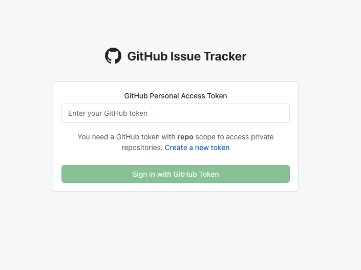

<div align="center">

# 🔍 GitHub Issues Tracker

**Track GitHub issues that received comments after closure with ease**

[](https://github-issues-tracker-one.vercel.app/)
[](https://github.com/yourusername/github-issues-tracker)
[](LICENSE)
[](https://reactjs.org/)
[](https://github.com/yourusername/github-issues-tracker)



</div>

---

## ✨ What is GitHub Issues Tracker?

A powerful, user-friendly web application that helps you discover and manage GitHub issues that have received comments **after** they were closed. Perfect for maintainers, developers, and project managers who want to stay on top of post-closure discussions and potential reopening candidates.

### 🎯 **Why Use This Tool?**
- **Save Time**: Instantly find issues with post-closure activity
- **Stay Informed**: Never miss important discussions on closed issues
- **Better Management**: Identify issues that might need reopening
- **Organization Insights**: Get comprehensive repository overviews

## 🚀 Quick Start

**Get started in 3 simple steps:**

1. **🌐 Visit the App** → [github-issues-tracker-one.vercel.app](https://github-issues-tracker-one.vercel.app/)
2. **🔑 Add Your Token** → Enter your GitHub personal access token
3. **🔍 Start Exploring** → Select repositories and discover post-closure issues!

> **📝 Need a GitHub token?** [Create one here](https://github.com/settings/tokens) with `repo` permissions

---

## 🎆 Key Features

<table>
<tr>
<td width="50%">

### 🔍 **Issue Discovery**
- Find closed issues with post-closure comments
- Smart filtering by comment count and dates
- Instant search across repositories
- Visual issue cards with key information

### 🏢 **Organization Insights**
- Complete Auth0 repository overview
- License information and compliance
- Repository statistics and metrics
- Professional PDF reports

</td>
<td width="50%">

### 🔒 **Secure & Private**
- GitHub token-based authentication
- No data stored on our servers
- Local browser storage only
- Revoke access anytime

### ⚙️ **User Experience**
- Clean, intuitive interface
- Mobile-responsive design
- Fast loading and navigation
- Persistent user preferences

</td>
</tr>
</table>

## 📝 Table of Contents

- [📚 How to Use](#how-to-use)
- [🎆 Key Features](#key-features)
- [📈 Screenshots & Demo](#screenshots--demo)
- [🔧 For Developers](#for-developers)
- [❓ FAQ](#faq)
- [🐛 Troubleshooting](#troubleshooting)
- [📞 Support](#support)
- [📄 License](#license)

---

## 📚 How to Use

### 🔑 **Step 1: Authentication**
1. Visit the [live application](https://github-issues-tracker-one.vercel.app/)
2. Click "Sign In" or navigate to Settings
3. Enter your GitHub Personal Access Token
   - **Don't have one?** [Create a token here](https://github.com/settings/tokens)
   - **Required permissions**: `repo` (for private repos) or `public_repo` (for public repos only)
4. Click "Save" - your token is stored securely in your browser

### 📁 **Step 2: Explore Repositories**

#### **Option A: Browse Your Repositories**
1. Go to the **Home** page
2. Select any repository from the sidebar
3. View issues that received comments after closure
4. Use filters to refine your search:
   - Minimum comment count
   - Date ranges
   - Sort by activity or closure date

#### **Option B: Auth0 Organization View**
1. Navigate to **"Auth0 Repos"** from the sidebar
2. Browse all Auth0 repositories in a clean table format
3. View license information, stars, forks, and last update dates
4. Click repository names to visit them on GitHub
5. Download comprehensive PDF reports

### 📊 **Step 3: Analyze Issues**
- **Issue Cards**: Each issue shows title, closure date, and comment count
- **Post-Closure Comments**: Toggle to view comments made after closure
- **GitHub Integration**: Click issue titles to view full details on GitHub
- **Smart Filtering**: Find exactly what you're looking for with advanced filters

### 📄 **Step 4: Export Data (Auth0 Repos)**
1. Navigate to the Auth0 Repos page
2. Click the **"Download PDF"** button
3. Get a professionally formatted report with:
   - Repository statistics
   - Complete repository listing
   - License information
   - Timestamped filename for easy organization

## 📈 Screenshots & Demo

### 🎥 **Live Demo**

👉 **[Try it now](https://github-issues-tracker-one.vercel.app/)** - No installation required!

### 🖼️ **Screenshots**

<div align="center">
  
  <br>
  <em>📊 Main dashboard showing issue tracking and repository management</em>
</div>

---

## ❓ FAQ

<details>
<summary><strong>🔑 Is my GitHub token safe?</strong></summary>

**Absolutely!** Your token is:
- Stored only in your browser's local storage
- Never sent to our servers
- Only used to communicate directly with GitHub's API
- Can be revoked anytime from your GitHub settings

</details>

<details>
<summary><strong>💰 Is this free to use?</strong></summary>

**Yes, completely free!** This is an open-source project with no hidden costs or premium features.

</details>

<details>
<summary><strong>🔍 What types of issues does it find?</strong></summary>

The app finds GitHub issues that:
- Were closed by maintainers or contributors
- Received one or more comments **after** the closure date
- Are from repositories you have access to

</details>

<details>
<summary><strong>🏢 Why focus on Auth0 repositories?</strong></summary>

The Auth0 organization view provides:
- Comprehensive license compliance overview
- Repository health metrics
- Easy PDF reporting for documentation
- Useful for open-source governance

</details>

<details>
<summary><strong>📄 What's included in PDF reports?</strong></summary>

PDF reports contain:
- Complete repository listing with metadata
- License information and links
- Statistics (stars, forks, languages)
- Last update dates
- Professional formatting

</details>

---

## 🐛 Troubleshooting

### 🚫 **"Authentication Failed" Error**

**Solution:**
1. Check your token has the correct permissions (`repo` or `public_repo`)
2. Ensure the token hasn't expired
3. Try creating a new token
4. Clear browser cache and try again

### 📁 **"No Repositories Found"**

**Solution:**
1. Verify your token has access to the repositories
2. Check if you're a collaborator on the repositories
3. Ensure repositories aren't archived
4. Try refreshing the page

### ⏳ **Slow Loading Issues**

**Solution:**
1. Check your internet connection
2. GitHub API might be experiencing delays
3. Try reducing the number of repositories being processed
4. Clear browser cache

### 📄 **PDF Download Not Working**

**Solution:**
1. Ensure pop-ups are allowed for the site
2. Check if browser blocks downloads
3. Try a different browser
4. Ensure repositories have loaded completely

---

## 📞 Support

**Need help?** We're here for you!

- 🐛 **Found a bug?** [Open an issue](https://github.com/yourusername/github-issues-tracker/issues)
- ❓ **Have a question?** [Start a discussion](https://github.com/yourusername/github-issues-tracker/discussions)
- 💡 **Feature request?** [Submit an idea](https://github.com/yourusername/github-issues-tracker/issues/new?template=feature_request.md)
- 📧 **Email support:** support@github-issues-tracker.com

---

## 🔧 For Developers

<details>
<summary><strong>Click to expand developer information</strong></summary>

### 🛠️ **Local Development Setup**

```bash
# Clone the repository
git clone https://github.com/yourusername/github-issues-tracker.git
cd github-issues-tracker

# Install dependencies
npm install

# Start development server
npm run dev

# Build for production
npm run build
```

### 📎 **Requirements**
- Node.js 14.0 or newer
- Modern web browser
- GitHub personal access token

### 🏢 **Architecture**
Built with React using MVVM pattern for clean separation of concerns.

</details>

---

## 📄 License

This project is licensed under the **MIT License** - see the [LICENSE.md](LICENSE.md) file for details.

**TL;DR**: You can use, modify, and distribute this software freely. Just include the original license notice.

---

## 🙏 Acknowledgments

**Special thanks to:**

- 💙 **GitHub** for providing the amazing API that powers this application
- ⚙️ **React Team** for the incredible framework
- 🎨 **Styled Components** for beautiful, maintainable styling
- 📄 **jsPDF** for enabling professional PDF generation
- 🏢 **Auth0** for the inspiration behind the organization view
- 🎆 **Open Source Community** for continuous inspiration and support

---


<div align="center">

**Made with ❤️ by developers, for developers**

[🌐 Live Demo](https://github-issues-tracker-one.vercel.app/) • [🐛 Report Bug](https://github.com/yourusername/github-issues-tracker/issues) • [💡 Request Feature](https://github.com/yourusername/github-issues-tracker/issues/new?template=feature_request.md)

**© 2024 GitHub Issues Tracker. All rights reserved.**

</div>
