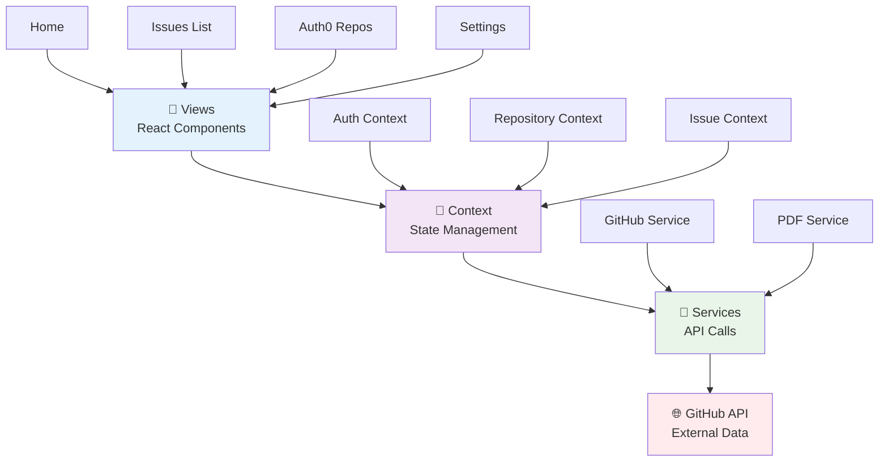

# GitHub Issue Tracker

A modern React application that helps you track GitHub issues that have received comments after they were closed. Built with React, this tool follows the MVVM (Model-View-ViewModel) architecture pattern to maintain a clean separation of concerns.

## 🚀 Live Application

> **[🌐 View Live Application](https://github-issues-tracker-one.vercel.app/)**
> 
> Experience the GitHub Issues Tracker in action! Click the link above to access the deployed application.

## ✨ Features

- 🔒 **Secure Authentication**: Authenticate with your GitHub personal access token
- 🔍 **Repository Selection**: Choose from your accessible repositories
- 📊 **Issue Tracking**: Find closed issues that have received comments after closure
- 🏢 **Auth0 Organization View**: Browse all Auth0 repositories with license information in a tabular format
- 📄 **PDF Export**: Download repository data as professionally formatted PDF reports
- 🔄 **Filtering & Sorting**: Filter issues by minimum comment count, closure date, and more
- 💾 **Data Persistence**: Save your preferences and settings between sessions
- 📈 **Statistics Dashboard**: View comprehensive stats for organization repositories

## 📝 Table of Contents

- [🛠️ Installation](#installation)
- [🚀 Usage](#usage)
  - [🏢 Auth0 Organization Repositories](#auth0-organization-repositories)
- [📎 Requirements](#requirements)
- [🏢 Application Structure](#application-structure)
- [🔗 API Integration](#api-integration)
- [🔐 Authentication](#authentication)
- [🤝 Contributing](#contributing)
- [📄 License](#license)

## 🛠️ Installation

Follow these steps to set up the project locally:

1. Clone the repository:
   ```bash
   git clone https://github.com/yourusername/github-issue-tracker.git
   cd github-issue-tracker
   ```

2. Install dependencies:
   ```bash
   npm install
   ```

3. Start the development server:
   ```bash
   npm run dev
   ```

4. Build for production:
   ```bash
   npm run build
   ```

## 🚀 Usage

### Getting Started

1. **Obtain a GitHub Token**:
   - Visit [GitHub Personal Access Tokens](https://github.com/settings/tokens)
   - Create a new token with `repo` scope
   - Copy your new token

2. **Sign In**:
   - Launch the application
   - Enter your GitHub token when prompted
   - The app will validate your token and retrieve your user information

3. **Select a Repository**:
   - Choose a repository from the sidebar
   - Or use the search function to find a specific repository

4. **View Issues with Post-Closure Comments**:
   - The app will automatically fetch closed issues with comments after closure
   - Issues are displayed in cards with essential information

### Features

#### Filtering Issues

- **Minimum Comments**: Set a threshold for the minimum number of post-closure comments
- **Date Filter**: Show only issues closed after a specific date
- **Sorting**: Sort issues by:
  - Closed date (newest/oldest)
  - Number of post-closure comments (most/fewest)

#### Viewing Issue Details

- Click on an issue title to view the full issue on GitHub
- Toggle "Show comments" to view post-closure comments inline
- See comment authors and timestamps

#### User Settings

- Update your GitHub token if necessary
- View your GitHub profile information
- Sign out when finished

### 🏢 Auth0 Organization Repositories

The application includes a dedicated view for browsing Auth0 organization repositories:

#### Features:
- **📋 Tabular View**: Clean, organized table displaying all Auth0 repositories
- **📄 License Information**: View license types with direct links to license files
- **📈 Repository Stats**: See stars, forks, primary language, and last update dates
- **📊 Statistics Dashboard**: Overview showing total repositories, licensed repos, private repos, and forks
- **📁 PDF Export**: Download comprehensive repository reports as formatted PDF files

#### How to Use:
1. Navigate to "Auth0 Repos" from the sidebar
2. Browse repositories in the interactive table
3. Click on repository names to visit them on GitHub
4. Click on license badges to view license files
5. Use the "Download PDF" button to export data

#### PDF Reports Include:
- Complete repository listing with all metadata
- Statistics summary
- Professional formatting with proper column alignment
- Timestamped filename for easy organization

## 📎 Requirements

- Node.js 14.0 or newer
- GitHub account with personal access token
- Modern web browser (Chrome, Firefox, Safari, Edge)

## 🏢 Application Structure

The application follows the MVVM (Model-View-ViewModel) architecture pattern with React Context for state management:



### 📁 Directory Structure

```
src/
├── 🎨 views/
│   ├── pages/          # Main application pages
│   │   ├── Home.jsx
│   │   ├── IssuesList.jsx
│   │   ├── Auth0Repos.jsx
│   │   ├── Settings.jsx
│   │   └── Login.jsx
│   └── components/     # Reusable UI components
│       ├── Sidebar.jsx
│       ├── IssueCard.jsx
│       └── Common/
├── 🧠 contexts/        # React Context Providers (ViewModels)
│   ├── AuthContext.jsx
│   ├── RepositoryContext.jsx
│   └── IssueContext.jsx
├── 🔧 services/        # External API integrations
│   ├── github-service.js
│   ├── storage-service.js
│   └── pdf-service.js
├── 📊 models/          # Data structures and validation
│   ├── User.js
│   ├── Repository.js
│   ├── Issue.js
│   └── Comment.js
└── 🎯 utils/          # Helper functions
    ├── constants.js
    └── helpers.js
```

### 🔄 Data Flow

1. **Views** trigger actions through user interactions
2. **Context Providers** manage state and coordinate between components
3. **Services** handle external API calls and data processing
4. **Models** define data structure and validation rules
5. **External APIs** provide data sources (GitHub API, Browser Storage)

## 🔗 API Integration

The application uses the GitHub REST API v3 to:

1. Verify user authentication
2. Fetch user repositories
3. Get closed issues from repositories
4. Retrieve issue comments
5. Compare issue closed date with comment creation dates

Rate limiting is automatically handled to prevent API usage limits.

## 🔐 Authentication

Authentication is implemented using GitHub personal access tokens, which provides:

- Secure access to GitHub APIs
- No need to store user passwords
- Fine-grained permission control
- Ability to revoke access at any time

Tokens are stored securely in the browser's localStorage for persistence between sessions.

## 🤝 Contributing

Contributions are welcome! Please feel free to submit a Pull Request.

1. Fork the repository
2. Create your feature branch (`git checkout -b feature/amazing-feature`)
3. Commit your changes (`git commit -m 'Add some amazing feature'`)
4. Push to the branch (`git push origin feature/amazing-feature`)
5. Open a Pull Request

## 📄 License

Distributed under the MIT License. See `LICENSE` for more information.